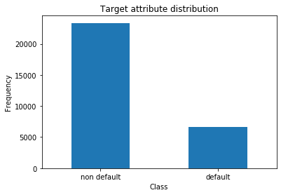
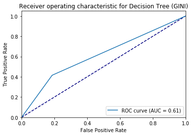
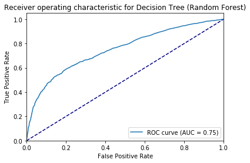
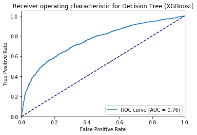

# BUILDING A FRAUD DETECTION MODEL

---


## Table of Contents
1. Problem Description (Brief Write Up)
2. Exploratory Data Analysis (EDA)
3. Data Pre-processing
4. Model Selection
5. Evaluation
6. Discussion and Possible Improvements

## 1. Problem Description

The data set we will be working on contains payment information of 30,000 credit card holders obtained from a bank in Taiwan. 

Each data sample is described by 23 feature attributes and a binary target feature (default or not) valued 0 (= not default) or 1 (= default). 

The 23 explanatory attributes are:

### X1 - X5: Indivual attributes of customer

X1: Amount of the given credit (NT dollar): it includes both the individual consumer credit and his/her family (supplementary) credit. 

X2: Gender (1 = male; 2 = female). 

X3: Education (1 = graduate school; 2 = university; 3 = high school; 4 = others). 

X4: Marital status (1 = married; 2 = single; 3 = others). 

X5: Age (year). 

### X6 - X11: Repayment history from April to Septemeber 2005
The measurement scale for the repayment status is: -1 = pay duly; 1 = payment delay for one month; 2 = payment delay for two months, . . . 8 = payment delay for eight months; 9 = payment delay for nine months and above.


X6 = the repayment status in September, 2005

X7 = the repayment status in August, 2005

X8 = the repayment status in July, 2005

X9 = the repayment status in June, 2005

X10 = the repayment status in May, 2005

X11 = the repayment status in April, 2005. 

### X12 - X17: Amount of bill statement (NT dollar) from April to September 2005

X12 = amount of bill statement in September, 2005; 

X13 = amount of bill statement in August, 2005

. . .

X17 = amount of bill statement in April, 2005. 

### X18 - X23: Amount of previous payment (NT dollar)
X18 = amount paid in September, 2005

X19 = amount paid in August, 2005

. . .

X23 = amount paid in April, 2005. 


## EDA

In this section we will explore the data set, its shape and its features to get an idea of the data.

### Importing packages and the dataset


```
import pandas as pd
```


```
import matplotlib.pyplot as plt
import seaborn as sns
```


```
url = 'https://raw.githubusercontent.com/reonho/bt2101disrudy/master/card.csv'
df = pd.read_csv(url,  header = 1, index_col = 0)
# Dataset is now stored in a Pandas Dataframe
df0 = df
```


```
#rename the target variable to "Y" for convenience
df["Y"] = df["default payment next month"] 
df = df.drop("default payment next month", axis = 1)
df.head()
```


<div>
<style scoped>
    .dataframe tbody tr th:only-of-type {
        vertical-align: middle;
    }

    .dataframe tbody tr th {
        vertical-align: top;
    }

    .dataframe thead th {
        text-align: right;
    }
</style>
<table border="1" class="dataframe">
  <thead>
    <tr style="text-align: right;">
      <th></th>
      <th>LIMIT_BAL</th>
      <th>SEX</th>
      <th>EDUCATION</th>
      <th>MARRIAGE</th>
      <th>AGE</th>
      <th>PAY_0</th>
      <th>PAY_2</th>
      <th>PAY_3</th>
      <th>PAY_4</th>
      <th>PAY_5</th>
      <th>...</th>
      <th>BILL_AMT4</th>
      <th>BILL_AMT5</th>
      <th>BILL_AMT6</th>
      <th>PAY_AMT1</th>
      <th>PAY_AMT2</th>
      <th>PAY_AMT3</th>
      <th>PAY_AMT4</th>
      <th>PAY_AMT5</th>
      <th>PAY_AMT6</th>
      <th>Y</th>
    </tr>
    <tr>
      <th>ID</th>
      <th></th>
      <th></th>
      <th></th>
      <th></th>
      <th></th>
      <th></th>
      <th></th>
      <th></th>
      <th></th>
      <th></th>
      <th></th>
      <th></th>
      <th></th>
      <th></th>
      <th></th>
      <th></th>
      <th></th>
      <th></th>
      <th></th>
      <th></th>
      <th></th>
    </tr>
  </thead>
  <tbody>
    <tr>
      <td>1</td>
      <td>20000</td>
      <td>2</td>
      <td>2</td>
      <td>1</td>
      <td>24</td>
      <td>2</td>
      <td>2</td>
      <td>-1</td>
      <td>-1</td>
      <td>-2</td>
      <td>...</td>
      <td>0</td>
      <td>0</td>
      <td>0</td>
      <td>0</td>
      <td>689</td>
      <td>0</td>
      <td>0</td>
      <td>0</td>
      <td>0</td>
      <td>1</td>
    </tr>
    <tr>
      <td>2</td>
      <td>120000</td>
      <td>2</td>
      <td>2</td>
      <td>2</td>
      <td>26</td>
      <td>-1</td>
      <td>2</td>
      <td>0</td>
      <td>0</td>
      <td>0</td>
      <td>...</td>
      <td>3272</td>
      <td>3455</td>
      <td>3261</td>
      <td>0</td>
      <td>1000</td>
      <td>1000</td>
      <td>1000</td>
      <td>0</td>
      <td>2000</td>
      <td>1</td>
    </tr>
    <tr>
      <td>3</td>
      <td>90000</td>
      <td>2</td>
      <td>2</td>
      <td>2</td>
      <td>34</td>
      <td>0</td>
      <td>0</td>
      <td>0</td>
      <td>0</td>
      <td>0</td>
      <td>...</td>
      <td>14331</td>
      <td>14948</td>
      <td>15549</td>
      <td>1518</td>
      <td>1500</td>
      <td>1000</td>
      <td>1000</td>
      <td>1000</td>
      <td>5000</td>
      <td>0</td>
    </tr>
    <tr>
      <td>4</td>
      <td>50000</td>
      <td>2</td>
      <td>2</td>
      <td>1</td>
      <td>37</td>
      <td>0</td>
      <td>0</td>
      <td>0</td>
      <td>0</td>
      <td>0</td>
      <td>...</td>
      <td>28314</td>
      <td>28959</td>
      <td>29547</td>
      <td>2000</td>
      <td>2019</td>
      <td>1200</td>
      <td>1100</td>
      <td>1069</td>
      <td>1000</td>
      <td>0</td>
    </tr>
    <tr>
      <td>5</td>
      <td>50000</td>
      <td>1</td>
      <td>2</td>
      <td>1</td>
      <td>57</td>
      <td>-1</td>
      <td>0</td>
      <td>-1</td>
      <td>0</td>
      <td>0</td>
      <td>...</td>
      <td>20940</td>
      <td>19146</td>
      <td>19131</td>
      <td>2000</td>
      <td>36681</td>
      <td>10000</td>
      <td>9000</td>
      <td>689</td>
      <td>679</td>
      <td>0</td>
    </tr>
  </tbody>
</table>
<p>5 rows × 24 columns</p>
</div>


```
size = df.shape
print("Data has {} Columns and {} Rows".format(size[1], size[0]))
```

    Data has 24 Columns and 30000 Rows
    


```
#check for null values
df.isnull().any().sum() 
```


    0


There are no null values in the data.

We can also calculate some summary statistics for each attribute.


```
df.describe()
```


<div>
<style scoped>
    .dataframe tbody tr th:only-of-type {
        vertical-align: middle;
    }

    .dataframe tbody tr th {
        vertical-align: top;
    }

    .dataframe thead th {
        text-align: right;
    }
</style>
<table border="1" class="dataframe">
  <thead>
    <tr style="text-align: right;">
      <th></th>
      <th>LIMIT_BAL</th>
      <th>SEX</th>
      <th>EDUCATION</th>
      <th>MARRIAGE</th>
      <th>AGE</th>
      <th>PAY_0</th>
      <th>PAY_2</th>
      <th>PAY_3</th>
      <th>PAY_4</th>
      <th>PAY_5</th>
      <th>...</th>
      <th>BILL_AMT4</th>
      <th>BILL_AMT5</th>
      <th>BILL_AMT6</th>
      <th>PAY_AMT1</th>
      <th>PAY_AMT2</th>
      <th>PAY_AMT3</th>
      <th>PAY_AMT4</th>
      <th>PAY_AMT5</th>
      <th>PAY_AMT6</th>
      <th>Y</th>
    </tr>
  </thead>
  <tbody>
    <tr>
      <td>count</td>
      <td>30000.000000</td>
      <td>30000.000000</td>
      <td>30000.000000</td>
      <td>30000.000000</td>
      <td>30000.000000</td>
      <td>30000.000000</td>
      <td>30000.000000</td>
      <td>30000.000000</td>
      <td>30000.000000</td>
      <td>30000.000000</td>
      <td>...</td>
      <td>30000.000000</td>
      <td>30000.000000</td>
      <td>30000.000000</td>
      <td>30000.000000</td>
      <td>3.000000e+04</td>
      <td>30000.00000</td>
      <td>30000.000000</td>
      <td>30000.000000</td>
      <td>30000.000000</td>
      <td>30000.000000</td>
    </tr>
    <tr>
      <td>mean</td>
      <td>167484.322667</td>
      <td>1.603733</td>
      <td>1.853133</td>
      <td>1.551867</td>
      <td>35.485500</td>
      <td>-0.016700</td>
      <td>-0.133767</td>
      <td>-0.166200</td>
      <td>-0.220667</td>
      <td>-0.266200</td>
      <td>...</td>
      <td>43262.948967</td>
      <td>40311.400967</td>
      <td>38871.760400</td>
      <td>5663.580500</td>
      <td>5.921163e+03</td>
      <td>5225.68150</td>
      <td>4826.076867</td>
      <td>4799.387633</td>
      <td>5215.502567</td>
      <td>0.221200</td>
    </tr>
    <tr>
      <td>std</td>
      <td>129747.661567</td>
      <td>0.489129</td>
      <td>0.790349</td>
      <td>0.521970</td>
      <td>9.217904</td>
      <td>1.123802</td>
      <td>1.197186</td>
      <td>1.196868</td>
      <td>1.169139</td>
      <td>1.133187</td>
      <td>...</td>
      <td>64332.856134</td>
      <td>60797.155770</td>
      <td>59554.107537</td>
      <td>16563.280354</td>
      <td>2.304087e+04</td>
      <td>17606.96147</td>
      <td>15666.159744</td>
      <td>15278.305679</td>
      <td>17777.465775</td>
      <td>0.415062</td>
    </tr>
    <tr>
      <td>min</td>
      <td>10000.000000</td>
      <td>1.000000</td>
      <td>0.000000</td>
      <td>0.000000</td>
      <td>21.000000</td>
      <td>-2.000000</td>
      <td>-2.000000</td>
      <td>-2.000000</td>
      <td>-2.000000</td>
      <td>-2.000000</td>
      <td>...</td>
      <td>-170000.000000</td>
      <td>-81334.000000</td>
      <td>-339603.000000</td>
      <td>0.000000</td>
      <td>0.000000e+00</td>
      <td>0.00000</td>
      <td>0.000000</td>
      <td>0.000000</td>
      <td>0.000000</td>
      <td>0.000000</td>
    </tr>
    <tr>
      <td>25%</td>
      <td>50000.000000</td>
      <td>1.000000</td>
      <td>1.000000</td>
      <td>1.000000</td>
      <td>28.000000</td>
      <td>-1.000000</td>
      <td>-1.000000</td>
      <td>-1.000000</td>
      <td>-1.000000</td>
      <td>-1.000000</td>
      <td>...</td>
      <td>2326.750000</td>
      <td>1763.000000</td>
      <td>1256.000000</td>
      <td>1000.000000</td>
      <td>8.330000e+02</td>
      <td>390.00000</td>
      <td>296.000000</td>
      <td>252.500000</td>
      <td>117.750000</td>
      <td>0.000000</td>
    </tr>
    <tr>
      <td>50%</td>
      <td>140000.000000</td>
      <td>2.000000</td>
      <td>2.000000</td>
      <td>2.000000</td>
      <td>34.000000</td>
      <td>0.000000</td>
      <td>0.000000</td>
      <td>0.000000</td>
      <td>0.000000</td>
      <td>0.000000</td>
      <td>...</td>
      <td>19052.000000</td>
      <td>18104.500000</td>
      <td>17071.000000</td>
      <td>2100.000000</td>
      <td>2.009000e+03</td>
      <td>1800.00000</td>
      <td>1500.000000</td>
      <td>1500.000000</td>
      <td>1500.000000</td>
      <td>0.000000</td>
    </tr>
    <tr>
      <td>75%</td>
      <td>240000.000000</td>
      <td>2.000000</td>
      <td>2.000000</td>
      <td>2.000000</td>
      <td>41.000000</td>
      <td>0.000000</td>
      <td>0.000000</td>
      <td>0.000000</td>
      <td>0.000000</td>
      <td>0.000000</td>
      <td>...</td>
      <td>54506.000000</td>
      <td>50190.500000</td>
      <td>49198.250000</td>
      <td>5006.000000</td>
      <td>5.000000e+03</td>
      <td>4505.00000</td>
      <td>4013.250000</td>
      <td>4031.500000</td>
      <td>4000.000000</td>
      <td>0.000000</td>
    </tr>
    <tr>
      <td>max</td>
      <td>1000000.000000</td>
      <td>2.000000</td>
      <td>6.000000</td>
      <td>3.000000</td>
      <td>79.000000</td>
      <td>8.000000</td>
      <td>8.000000</td>
      <td>8.000000</td>
      <td>8.000000</td>
      <td>8.000000</td>
      <td>...</td>
      <td>891586.000000</td>
      <td>927171.000000</td>
      <td>961664.000000</td>
      <td>873552.000000</td>
      <td>1.684259e+06</td>
      <td>896040.00000</td>
      <td>621000.000000</td>
      <td>426529.000000</td>
      <td>528666.000000</td>
      <td>1.000000</td>
    </tr>
  </tbody>
</table>
<p>8 rows × 24 columns</p>
</div>


### Exploring the features

**1) Exploring target attribute:**


```
All = df.shape[0]
default = df[df['Y'] == 1]
nondefault = df[df['Y'] == 0]

x = len(default)/All
y = len(nondefault)/All

print('defaults :',x*100,'%')
print('non defaults :',y*100,'%')
```

    defaults : 22.12 %
    non defaults : 77.88000000000001 %
    


```
# plotting target attribute against frequency
labels = ['non default','default']
classes = pd.value_counts(df['Y'], sort = True)
classes.plot(kind = 'bar', rot=0)
plt.title("Target attribute distribution")
plt.xticks(range(2), labels)
plt.xlabel("Class")
plt.ylabel("Frequency")
```


    Text(0, 0.5, 'Frequency')





**2) Exploring categorical attributes**

Categorical attributes are:
- Sex
- Education
- Marriage

**2a) Checking formatting for categorical attributes:**

Since all categorical attributes are in numerical format, there is no need to convert them into numerical factors.

**2b) Analysis of categorical data groups**

- Sex
- Education
- Marriage


```
print(df["SEX"].value_counts().apply(lambda r: r/All*100))
print("--------------------------------------------------------")
print(df["EDUCATION"].value_counts().apply(lambda r: r/All*100))
print("--------------------------------------------------------")
print(df["MARRIAGE"].value_counts().apply(lambda r: r/All*100))
```

    2    60.373333
    1    39.626667
    Name: SEX, dtype: float64
    --------------------------------------------------------
    2    46.766667
    1    35.283333
    3    16.390000
    5     0.933333
    4     0.410000
    6     0.170000
    0     0.046667
    Name: EDUCATION, dtype: float64
    --------------------------------------------------------
    2    53.213333
    1    45.530000
    3     1.076667
    0     0.180000
    Name: MARRIAGE, dtype: float64
    

**Conclusion**

- Categorical variable SEX does not seem to have any missing/extra groups, and it is separated into Male = 1 and Female = 2
- Categorical variable MARRIAGE seems to have unknown group = 0, which could be assumed to be missing data, with other groups being Married = 1, Single = 2, Others = 3
- Categorical variable EDUCATION seems to have unknown group = 0,5,6, with other groups being graduate school = 1, university = 2, high school = 3, others = 4

**2c) Analysing the relationship between categorical attributes and default paymment (target attribute)**

- Sex
- Education
- Marriage


```
#proportion of target attribute (for reference)
print('Total target attributes:')
print('non defaults :',y*100,'%')
print('defaults :',x*100,'%')
print("--------------------------------------------------------")
#analysing default payment with Sex
sex_target = pd.crosstab(df["Y"], df["SEX"]).apply(lambda r: r/r.sum()*100).rename(columns = {1: "Male", 2: "Female"}, index = {0: "non defaults", 1: "defaults"})
print(sex_target)
print("--------------------------------------------------------")
#analysing default payment with education
education_target = pd.crosstab(df["Y"], df["EDUCATION"]).apply(lambda r: r/r.sum()*100).rename(index = {0: "non defaults", 1: "defaults"})
print(education_target)
print("--------------------------------------------------------")
#analysing default payment with marriage
marriage_target = pd.crosstab(df["Y"], df["MARRIAGE"]).apply(lambda r: r/r.sum()*100).rename(columns = {0: "unknown",1: "married", 2: "single", 3: "others"},index = {0: "non defaults", 1: "defaults"})
print(marriage_target)
```

    Total target attributes:
    non defaults : 77.88000000000001 %
    defaults : 22.12 %
    --------------------------------------------------------
    SEX                Male     Female
    Y                                 
    non defaults  75.832773  79.223719
    defaults      24.167227  20.776281
    --------------------------------------------------------
    EDUCATION         0          1          2          3          4          5  \
    Y                                                                            
    non defaults  100.0  80.765234  76.265146  74.842384  94.308943  93.571429   
    defaults        0.0  19.234766  23.734854  25.157616   5.691057   6.428571   
    
    EDUCATION             6  
    Y                        
    non defaults  84.313725  
    defaults      15.686275  
    --------------------------------------------------------
    MARRIAGE        unknown    married     single     others
    Y                                                       
    non defaults  90.740741  76.528296  79.071661  73.993808
    defaults       9.259259  23.471704  20.928339  26.006192
    


```
# we would like to conduct a chi square test of independence using the contingency tables above
import scipy.stats as sp_stat

def sigf(p, confidence):
  return str(p) + " *** [Significant at the " + str(int(confidence*100)) + "% Level]" if p < 1-confidence else p

#print the p values for the test statistic of each chi-sq test
print("SEX:", sigf(sp_stat.chi2_contingency(sex_target)[1], 0.95))
print("EDUCATION:", sigf(sp_stat.chi2_contingency(education_target)[1],0.95))
print("MARRIAGE:", sigf(sp_stat.chi2_contingency(marriage_target)[1],0.95))
```

    SEX: 0.6854422910010494
    EDUCATION: 1.0276815835411287e-08 *** [Significant at the 95% Level]
    MARRIAGE: 0.016161318279331434 *** [Significant at the 95% Level]
    

**Conclusion**

Categorical attributes EDUCATION and MARRIAGE are associated with the target variable.

We will omit SEX from our models as it is statistically insignificant.

Categorical attributes SEX and MARRIAGE have approximately uniform distributions throughout groups of categories.

**3) Analysis of Numerical Attributes**

The numerical attributes are:
   


```
#printing numerical attributes
pd.DataFrame(df.drop(['SEX', 'EDUCATION', 'MARRIAGE','Y'], axis = 1).columns)
```


<div>
<style scoped>
    .dataframe tbody tr th:only-of-type {
        vertical-align: middle;
    }

    .dataframe tbody tr th {
        vertical-align: top;
    }

    .dataframe thead th {
        text-align: right;
    }
</style>
<table border="1" class="dataframe">
  <thead>
    <tr style="text-align: right;">
      <th></th>
      <th>0</th>
    </tr>
  </thead>
  <tbody>
    <tr>
      <td>0</td>
      <td>LIMIT_BAL</td>
    </tr>
    <tr>
      <td>1</td>
      <td>AGE</td>
    </tr>
    <tr>
      <td>2</td>
      <td>PAY_0</td>
    </tr>
    <tr>
      <td>3</td>
      <td>PAY_2</td>
    </tr>
    <tr>
      <td>4</td>
      <td>PAY_3</td>
    </tr>
    <tr>
      <td>5</td>
      <td>PAY_4</td>
    </tr>
    <tr>
      <td>6</td>
      <td>PAY_5</td>
    </tr>
    <tr>
      <td>7</td>
      <td>PAY_6</td>
    </tr>
    <tr>
      <td>8</td>
      <td>BILL_AMT1</td>
    </tr>
    <tr>
      <td>9</td>
      <td>BILL_AMT2</td>
    </tr>
    <tr>
      <td>10</td>
      <td>BILL_AMT3</td>
    </tr>
    <tr>
      <td>11</td>
      <td>BILL_AMT4</td>
    </tr>
    <tr>
      <td>12</td>
      <td>BILL_AMT5</td>
    </tr>
    <tr>
      <td>13</td>
      <td>BILL_AMT6</td>
    </tr>
    <tr>
      <td>14</td>
      <td>PAY_AMT1</td>
    </tr>
    <tr>
      <td>15</td>
      <td>PAY_AMT2</td>
    </tr>
    <tr>
      <td>16</td>
      <td>PAY_AMT3</td>
    </tr>
    <tr>
      <td>17</td>
      <td>PAY_AMT4</td>
    </tr>
    <tr>
      <td>18</td>
      <td>PAY_AMT5</td>
    </tr>
    <tr>
      <td>19</td>
      <td>PAY_AMT6</td>
    </tr>
  </tbody>
</table>
</div>


**Meaning of attributes PAY_0 to PAY_6**

The numeric value in these attributes shows the past history of a credit card holder, example -2 means: No consumption of credit card, -1 means that holder paid the full balance, 0 means the use of revolving credit; 1= paymentdelay of one month; 2= payment delay of two months and so on.


**3a) Limit Balance**


```
#Find out min and max value of LIMIT BALANCE
print(df["LIMIT_BAL"].describe())
```

    count      30000.000000
    mean      167484.322667
    std       129747.661567
    min        10000.000000
    25%        50000.000000
    50%       140000.000000
    75%       240000.000000
    max      1000000.000000
    Name: LIMIT_BAL, dtype: float64
    


```
sns.distplot(df["LIMIT_BAL"]).set_title('Distribution of Limit Balance')
```


    Text(0.5, 1.0, 'Distribution of Limit Balance')


**3b) Analysis of Age**


```
sns.distplot(df.AGE)
```


    <matplotlib.axes._subplots.AxesSubplot at 0x25606f88748>


To find out the relationships between the features, we calculate the absolute value of R with the target for all attributes. (R = Correlation Coefficient)


```
#absolute correlation coefficient
pd.DataFrame(df.drop(['SEX', 'EDUCATION', 'MARRIAGE','Y'], axis=1).apply(lambda x: x.corr(df.Y) if x.corr(df.Y) > 0 else -x.corr(df.Y)).sort_values(ascending = False))
```


<div>
<style scoped>
    .dataframe tbody tr th:only-of-type {
        vertical-align: middle;
    }

    .dataframe tbody tr th {
        vertical-align: top;
    }

    .dataframe thead th {
        text-align: right;
    }
</style>
<table border="1" class="dataframe">
  <thead>
    <tr style="text-align: right;">
      <th></th>
      <th>0</th>
    </tr>
  </thead>
  <tbody>
    <tr>
      <td>PAY_0</td>
      <td>0.324794</td>
    </tr>
    <tr>
      <td>PAY_2</td>
      <td>0.263551</td>
    </tr>
    <tr>
      <td>PAY_3</td>
      <td>0.235253</td>
    </tr>
    <tr>
      <td>PAY_4</td>
      <td>0.216614</td>
    </tr>
    <tr>
      <td>PAY_5</td>
      <td>0.204149</td>
    </tr>
    <tr>
      <td>PAY_6</td>
      <td>0.186866</td>
    </tr>
    <tr>
      <td>LIMIT_BAL</td>
      <td>0.153520</td>
    </tr>
    <tr>
      <td>PAY_AMT1</td>
      <td>0.072929</td>
    </tr>
    <tr>
      <td>PAY_AMT2</td>
      <td>0.058579</td>
    </tr>
    <tr>
      <td>PAY_AMT4</td>
      <td>0.056827</td>
    </tr>
    <tr>
      <td>PAY_AMT3</td>
      <td>0.056250</td>
    </tr>
    <tr>
      <td>PAY_AMT5</td>
      <td>0.055124</td>
    </tr>
    <tr>
      <td>PAY_AMT6</td>
      <td>0.053183</td>
    </tr>
    <tr>
      <td>BILL_AMT1</td>
      <td>0.019644</td>
    </tr>
    <tr>
      <td>BILL_AMT2</td>
      <td>0.014193</td>
    </tr>
    <tr>
      <td>BILL_AMT3</td>
      <td>0.014076</td>
    </tr>
    <tr>
      <td>AGE</td>
      <td>0.013890</td>
    </tr>
    <tr>
      <td>BILL_AMT4</td>
      <td>0.010156</td>
    </tr>
    <tr>
      <td>BILL_AMT5</td>
      <td>0.006760</td>
    </tr>
    <tr>
      <td>BILL_AMT6</td>
      <td>0.005372</td>
    </tr>
  </tbody>
</table>
</div>


We observe that the "repayment status" attributes are the most highly correlated with the target variable and we would expect them to be more significant in predicting credit default. In fact the later the status, the more correlated it is.

The least correlated attributes are the bill amounts.

We can also generate a correlation matrix (heatmap) to see which features are the most correlated with each other.


```
f = plt.figure(figsize=(19, 15))
plt.matshow(df.corr(), fignum=f.number)
plt.xticks(range(df.shape[1]), df.columns, fontsize=14, rotation=45)
plt.yticks(range(df.shape[1]), df.columns, fontsize=14)
cb = plt.colorbar()
cb.ax.tick_params(labelsize=14)
plt.title('Correlation Matrix', fontsize=16)
```


    Text(0.5, 1.05, 'Correlation Matrix')


The heatmap reveals that the payment and billed amounts across the 5 months are highly correlated with each other.  Highly Correlated factors should be removed before carrying out any regression to prevent multicollinearity.

- Linear regression
- Scatterplot matrix
- Boxplot matrix

## Data Preprocessing


???
1. get rid of unknown attributes
2. normalise
3. pca?


## Model Selection

In this part, we will fit machine learning models learnt in BT2101 to this classification problem, and pick the model that can produce the best results.

We will be attempting to fit the following models:
- K-Nearest Neighbour
- Support Vector Machine
- Decision Tree 
- Naive Bayes Classifier
- Logistic Regression
- Neural Network


```
#using kfold to create train test splits
import sklearn.model_selection as skm
kf = skm.KFold(10)
```


```
#using holdout sampling for train test split
ft = df.drop("Y", axis = 1)
target = df["Y"]
X_train,X_test,y_train,y_test = skm.train_test_split(ft,target,test_size=0.20)
```

To make things easier, we define a get_roc function that will plot an ROC curve for all the models we evaluate


```
def get_roc(model, y_test, x_test, name):
    fpr = roc_curve(y_test,model.predict_proba(X_test)[:,1])[0]
    tpr = roc_curve(y_test,model.predict_proba(X_test)[:,1])[1]

    plt.plot([0, 1], [0, 1], color='navy', linestyle='--')
    plt.xlim([0.0, 1.0])
    plt.ylim([0.0, 1.05])
    plt.xlabel('False Positive Rate')
    plt.ylabel('True Positive Rate')
    plt.title('Receiver operating characteristic for ' + name)
    plt.plot(fpr,tpr,label='ROC curve (AUC = %0.2f)' % (auc(fpr, tpr)))
    plt.legend(loc="lower right")
    plt.show()

```


```
def confusion(model, y_test, X_test, name):
    conf = pd.crosstab(y_test,model.predict(X_test), rownames=['Actual'], colnames=['Predicted'])
    print("Of " + str(conf[0][1] + conf[1][1]) + " Defaulters, the " + name + " identified " + str(conf[1][1])) 
    return conf
```

### Evaluation 
We will select the model based on the model evaluation. The key metrics we will compute are:
(Need someone to fill in the formula)

1. Accuracy
2. Precision
3. Recall
4. F1 Measure
5. AUROC

Because of the nature of a default detection problem, we would like to prioritise recall for defaults. 
This means we will place more importance in correctly identifying a defaulter than avoiding misclassifying a non-defaulter. (Assumming that the bank loses more money when lending to a defaulter than not lending to a non-defaulter)


### Baseline - Random Classifier (Test)
This part aims to provide a benchmark accuracy for our models, i.e. a random classifier with (expected) accuracy of 0.5.


```
from random import *
import sklearn.metrics as skmt

def rnjezus(i):
  return randint(0, 1)

# Holdout sampling
print("Holdout Sample Accuracy:")
print(skmt.classification_report(y_test, list(map(lambda x : rnjezus(x), range(len(X_test))))))

# K-fold
accuracies = []
for train,test in kf.split(df):
  prediction = list(map(lambda x : rnjezus(x), test))
  actual = list(df["Y"][test+1])
  
  #By definition the columns correspond to the predicted values and rows are the actuals
  conf_mat = skmt.confusion_matrix(actual, prediction)
  #print(pd.DataFrame(conf_mat))

  accuracies.append(skmt.accuracy_score(actual, prediction))

print("Kfold Average Accuracy:", sum(accuracies)/len(accuracies))
```

    Holdout Sample Accuracy:
                  precision    recall  f1-score   support
    
               0       0.78      0.50      0.61      4673
               1       0.22      0.51      0.31      1327
    
        accuracy                           0.50      6000
       macro avg       0.50      0.51      0.46      6000
    weighted avg       0.66      0.50      0.54      6000
    
    Kfold Average Accuracy: 0.4919999999999999
    

### Model 1 - K-Nearest Neighbour


```
import numpy as np
from sklearn.neighbors import KNeighborsClassifier

neighbours = np.arange(1,25)
train_accuracy =np.empty(len(neighbours))
test_accuracy = np.empty(len(neighbours))
                                
for i,k in enumerate(neighbours):
    #Setup a knn classifier with k neighbors
    knn=KNeighborsClassifier(n_neighbors=k,algorithm="kd_tree",n_jobs=-1)
    
    #Fit the model
    knn.fit(X_train,y_train.ravel())
    
    #Compute accuracy on the training set
    train_accuracy[i] = knn.score(X_train, y_train.ravel())
    
    #Compute accuracy on the test set
    test_accuracy[i] = knn.score(X_test, y_test.ravel())

```


```
#Generate plot
plt.title('k-NN Varying number of neighbors')
plt.plot(neighbours, test_accuracy, label='Testing Accuracy')
plt.plot(neighbours, train_accuracy, label='Training accuracy')
plt.legend()
plt.xlabel('Number of neighbors')
plt.ylabel('Accuracy')
plt.show()
```


```
# best k:
idx = np.where(test_accuracy == max(test_accuracy))
k = neighbours[idx][0]
knn = KNeighborsClassifier(n_neighbors=k,algorithm="kd_tree",n_jobs=-1)
knn.fit(X_train,y_train.ravel())
print(skmt.classification_report(y_test,knn.predict(X_test)))
```

                  precision    recall  f1-score   support
    
               0       0.79      0.98      0.87      4673
               1       0.51      0.08      0.13      1327
    
        accuracy                           0.78      6000
       macro avg       0.65      0.53      0.50      6000
    weighted avg       0.73      0.78      0.71      6000
    
    

Despite a reasonably high accuracy, the KNN model has very low recall for defaults.


```
confusion(knn, y_test, X_test, "KNN")
```

    Of 1327 Defaulters, the KNN identified 101
    


<div>
<style scoped>
    .dataframe tbody tr th:only-of-type {
        vertical-align: middle;
    }

    .dataframe tbody tr th {
        vertical-align: top;
    }

    .dataframe thead th {
        text-align: right;
    }
</style>
<table border="1" class="dataframe">
  <thead>
    <tr style="text-align: right;">
      <th>Predicted</th>
      <th>0</th>
      <th>1</th>
    </tr>
    <tr>
      <th>Actual</th>
      <th></th>
      <th></th>
    </tr>
  </thead>
  <tbody>
    <tr>
      <td>0</td>
      <td>4576</td>
      <td>97</td>
    </tr>
    <tr>
      <td>1</td>
      <td>1226</td>
      <td>101</td>
    </tr>
  </tbody>
</table>
</div>


### Model 2 - Decision Trees

#### Theory:
The decision tree algorithm aims to recursively split the data points in the training set until the data points are completely separated or well separated. At each iteration, the tree splits the datasets by the feature(s) that give the maximum reduction in heterogeneity, which is calculated by a heterogeneity index.

Below is a binary decision tree that has been split for a few iterations.


Since the target for this project is binary (fraud = yes or no) we will be building a binary decision tree, using the the GINI Index as the Heterogeneity index. The GINI is given by:


The GINI index measures how heterogenous a single node is (0 being completely homogenous and 1 being heterogenous). For each possible split, we will calculate the *weighted sum* of the GINI indices of the child nodes, and choose the split that results in the maximum information gain. i.e. reduction in the weighted sum of the GINI Index.

#### Training
We will now construct a simple decision tree using the GINI index.


```
from sklearn.tree import DecisionTreeClassifier
from sklearn.metrics import *
```


```
tree = DecisionTreeClassifier()
tree.fit(X_train, y_train)
```


    DecisionTreeClassifier(class_weight=None, criterion='gini', max_depth=None,
                           max_features=None, max_leaf_nodes=None,
                           min_impurity_decrease=0.0, min_impurity_split=None,
                           min_samples_leaf=1, min_samples_split=2,
                           min_weight_fraction_leaf=0.0, presort=False,
                           random_state=None, splitter='best')


```
print(classification_report(y_train, tree.predict(X_train)))
```

                  precision    recall  f1-score   support
    
               0       1.00      1.00      1.00     18691
               1       1.00      1.00      1.00      5309
    
        accuracy                           1.00     24000
       macro avg       1.00      1.00      1.00     24000
    weighted avg       1.00      1.00      1.00     24000
    
    

The training set accuracy is 1, which means the datapoints are completely separated by the decision tree. We evaluate on the test set below.


```
confusion(tree, y_test, X_test, "Decision Tree (GINI)")
```

    Of 1327 Defaulters, the Decision Tree (GINI) identified 550
    


<div>
<style scoped>
    .dataframe tbody tr th:only-of-type {
        vertical-align: middle;
    }

    .dataframe tbody tr th {
        vertical-align: top;
    }

    .dataframe thead th {
        text-align: right;
    }
</style>
<table border="1" class="dataframe">
  <thead>
    <tr style="text-align: right;">
      <th>Predicted</th>
      <th>0</th>
      <th>1</th>
    </tr>
    <tr>
      <th>Actual</th>
      <th></th>
      <th></th>
    </tr>
  </thead>
  <tbody>
    <tr>
      <td>0</td>
      <td>3804</td>
      <td>869</td>
    </tr>
    <tr>
      <td>1</td>
      <td>777</td>
      <td>550</td>
    </tr>
  </tbody>
</table>
</div>


```
get_roc(tree, y_test, X_test, "Decision Tree (GINI)")
```





```
print(classification_report(y_test, tree.predict(X_test)))
```

                  precision    recall  f1-score   support
    
               0       0.83      0.81      0.82      4673
               1       0.39      0.41      0.40      1327
    
        accuracy                           0.73      6000
       macro avg       0.61      0.61      0.61      6000
    weighted avg       0.73      0.73      0.73      6000
    
    

### Model 2b) Random Forest Classifier

#### Theory
Random Forest is an ensemble method for the decision tree algorithm. It works by randomly choosing different features and data points to train multiple trees (that is, to form a forest) - and the resulting prediction is decided by the votes from all the trees. 

Decision Trees are prone to overfitting on the training data, which reduces the performance on the test set. Random Forest mitigates this by training multiple trees. Random Forest is a form of bagging ensemble where the trees are trained concurrently. 

#### Training
To keep things consistent, our Random Forest classifier will also use the GINI Coefficient.


```
from sklearn.ensemble import RandomForestClassifier
randf = RandomForestClassifier(n_estimators=300)
```


```
randf.fit(X_train, y_train)
```


    RandomForestClassifier(bootstrap=True, class_weight=None, criterion='gini',
                           max_depth=None, max_features='auto', max_leaf_nodes=None,
                           min_impurity_decrease=0.0, min_impurity_split=None,
                           min_samples_leaf=1, min_samples_split=2,
                           min_weight_fraction_leaf=0.0, n_estimators=300,
                           n_jobs=None, oob_score=False, random_state=None,
                           verbose=0, warm_start=False)


```
print(classification_report(y_train, randf.predict(X_train)))
```

                  precision    recall  f1-score   support
    
               0       1.00      1.00      1.00     18691
               1       1.00      1.00      1.00      5309
    
        accuracy                           1.00     24000
       macro avg       1.00      1.00      1.00     24000
    weighted avg       1.00      1.00      1.00     24000
    
    

The training set has also been 100% correctly classified by the random forest model. Evaluating with the test set:


```
print(classification_report(y_test, randf.predict(X_test)))
```

                  precision    recall  f1-score   support
    
               0       0.84      0.94      0.89      4673
               1       0.63      0.36      0.46      1327
    
        accuracy                           0.81      6000
       macro avg       0.74      0.65      0.67      6000
    weighted avg       0.79      0.81      0.79      6000
    
    


```
get_roc(randf, y_test, X_test, "Decision Tree (Random Forest)")
```





The random forest ensemble performs much better than the decision tree alone. The accuracy and AUROC are both superior to the decision tree alone.

### Model 2c) xgBoost Classifier

#### Theory
xgBoost is short for "Extreme Gradient Boosting". It is a boosting ensemble method for decision trees. This means that the trees are trained consecutively, where each new tree added is trained to correct the error from the previous tree.

xgBoost uses the gradient descent algorithm that we learnt in BT2101 at each iteration to maximise the reduction in the error term. (More details? math?)
 
#### Training
For consistency our xgBoost ensemble will use n_estimators = 300 as we have done for the random forest ensemble.


```
from sklearn.ensemble import GradientBoostingClassifier
xgb = GradientBoostingClassifier(n_estimators=300, max_depth = 4)
xgb.fit(X_train, y_train)
```


    GradientBoostingClassifier(criterion='friedman_mse', init=None,
                               learning_rate=0.1, loss='deviance', max_depth=4,
                               max_features=None, max_leaf_nodes=None,
                               min_impurity_decrease=0.0, min_impurity_split=None,
                               min_samples_leaf=1, min_samples_split=2,
                               min_weight_fraction_leaf=0.0, n_estimators=300,
                               n_iter_no_change=None, presort='auto',
                               random_state=None, subsample=1.0, tol=0.0001,
                               validation_fraction=0.1, verbose=0,
                               warm_start=False)


```
print(classification_report(y_train, xgb.predict(X_train)))
```

                  precision    recall  f1-score   support
    
               0       0.86      0.96      0.91     18691
               1       0.76      0.45      0.56      5309
    
        accuracy                           0.85     24000
       macro avg       0.81      0.70      0.74     24000
    weighted avg       0.84      0.85      0.83     24000
    
    

We observe that the xgBoost ensemble did not fully separate the data in the training set. (The default maximum depth is 3, so that might be a factor). Evaluating on the test set,


```
print(classification_report(y_test, xgb.predict(X_test)))
```

                  precision    recall  f1-score   support
    
               0       0.84      0.94      0.89      4673
               1       0.63      0.35      0.45      1327
    
        accuracy                           0.81      6000
       macro avg       0.74      0.65      0.67      6000
    weighted avg       0.79      0.81      0.79      6000
    
    


```
get_roc(xgb, y_test, X_test, "Decision Tree (XGBoost)")
```





From the accuracy and AUROC, we observe that the XGBoost performs similarly to the random forest ensemble. It has a slight bump in AUROC at 0.76, but the accuracy is the same.

### Model x - Support Vector Machine


```
from sklearn import svm

#Linear classifier with cost function = 1
l_svm_clf = svm.SVC(C = 1, kernel = 'linear')
# the following line takes forever
l_svm_clf.fit(X_train, y_train) 

r_svm_clf = svm.SVC(C= 1, kernel = 'rbf')


```


```

```
